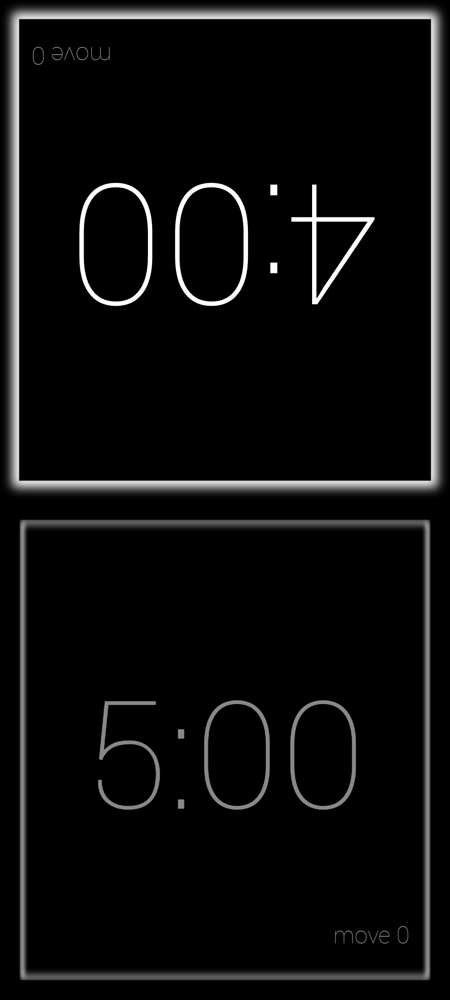
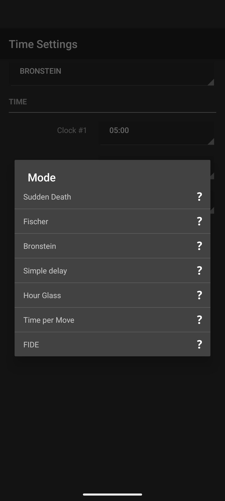

# Chess Clock

<p align="center">
  
  &nbsp;&nbsp;
  
</p>

A modernized Android port of **Game Clock Deluxe** (originally `fr.kazalox.android.gameclockdeluxe`) by Kazalox — my all-time favorite chess clock app, brought back to life for current Android versions.

## Why this exists

Game Clock Deluxe was the best chess clock app on Android. It had a clean dark UI, supported all the major time control formats (Fischer, Bronstein, FIDE, Sudden Death, Hour Glass, and more), and just worked. Unfortunately the app is no longer maintained and stopped functioning correctly on Android 10 and newer — making it unusable on any modern device.

Rather than go without, this project was created with AI assistance to produce a version that runs correctly on current Android devices (API 35 / Android 15).

## What changed from the original

- Targets Android 15 (API 35), minimum Android 5.0 (API 21)
- AndroidX migration — replaces the legacy support library
- Modern fullscreen and window insets handling
- All clock modes and features unlocked
- Removed promotional UI elements (the original in-app upgrade prompts checked Google Play for a purchase record — since the app is no longer on the Play Store this check always fails, making the prompts appear permanently)
- Minor UI polish (mode selection dialog, preferences screen)

## Building

Requirements: Android SDK (API 35), Java 17

```bash
./gradlew assembleDebug
adb install app/build/outputs/apk/debug/app-debug.apk
```

## Installing

A pre-built debug APK is available in [Releases](../../releases). Because it is signed with a debug key, you will need to enable **Install unknown apps** in your Android settings.

## Credits

Original app: **Game Clock Deluxe** by Kazalox  
Original package: `fr.kazalox.android.gameclockdeluxe`  
All game clock logic, UI design, and assets originate from the original application.  
This project exists solely to keep a great app working — all credit for the product goes to the original author.
